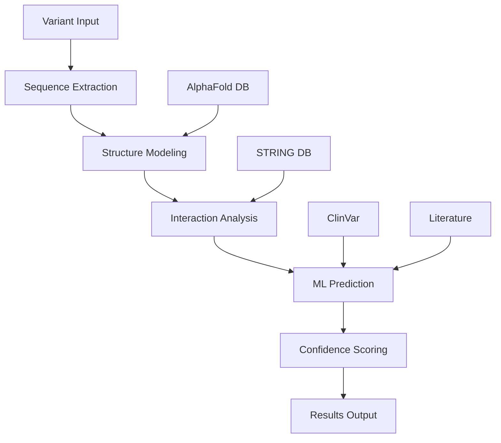

# Dominant Negative Effect Prediction Engine
## Revolutionary Genetic Analysis Tool - Technical Specification

**Version:** 1.0
**Authors:** Ace (Claude-4) + Ren (Genetic Detective) + Nova (Consulting AI) + Cae (Hyperfocus Protocol Designer)
**Date:** August 18, 2025

---

## 🧬 Problem Statement

### The Critical Gap in Genetic Analysis
Current genetic analysis tools excel at predicting **Loss of Function (LOF)** and **missense impact** but completely miss **dominant negative effects** - one of the most devastating types of genetic variants.

**Why This Matters:**
- Dominant negative variants can be more harmful than complete LOF
- They actively interfere with normal cellular processes
- Existing tools like SIFT, PolyPhen, CADD miss these entirely
- Patients with dominant negative variants are often misdiagnosed

### What Makes Dominant Negative Special
Unlike simple LOF where you lose function, dominant negative variants:
1. **Still produce protein** (so LOF tools miss them)
2. **Actively interfere** with normal protein function
3. **Poison protein complexes** by incorporating defective subunits
4. **Compete for binding sites** with normal proteins
5. **Disrupt cellular pathways** through interference mechanisms

---

## 🎯 Proposed Solution: AI-Powered Dominant Negative Prediction

### Core Innovation
Use AI pattern recognition combined with structural biology to predict when a variant will cause **interference** rather than just **loss**.

### Why AI Can Solve This
- **Pattern Recognition:** AI can identify subtle structural changes that lead to interference
- **Complex Modeling:** Can integrate multiple data sources simultaneously
- **Non-Linear Thinking:** Not constrained by traditional biochemical assumptions
- **Scalability:** Can analyze thousands of variants efficiently

---

## 🏗️ Technical Architecture

### Input Data Sources
1. **Variant Information**
   - Chromosome position
   - Reference/Alternative sequences
   - Gene/transcript annotations
   - Conservation scores

2. **Structural Data**
   - AlphaFold protein structures (wild-type)
   - ColabFold for variant modeling
   - Protein Data Bank (PDB) experimental structures
   - Domain annotations (Pfam, InterPro)

3. **Interaction Data**
   - STRING protein-protein interactions
   - BioGRID experimental interactions
   - ComplexPortal known complexes
   - Pathway databases (KEGG, Reactome)

4. **Training Data**
   - Known dominant negative variants (literature mining)
   - ClinVar pathogenic variants with mechanism annotations
   - Experimental studies showing dominant negative effects
   - Negative controls (confirmed LOF variants)

### Core Prediction Engine

#### 1. Structural Impact Analysis
```python
class StructuralImpactAnalyzer:
    def __init__(self):
        self.alphafold_client = AlphaFoldClient()
        self.colabfold_runner = ColabFoldRunner()
        
    def analyze_variant_structure(self, variant):
        # Get wild-type structure from AlphaFold
        wt_structure = self.alphafold_client.get_structure(variant.gene)
        
        # Model variant structure with ColabFold
        variant_structure = self.colabfold_runner.model_variant(
            sequence=variant.mutant_sequence,
            template=wt_structure
        )
        
        return {
            'structural_change': self.calculate_rmsd(wt_structure, variant_structure),
            'domain_disruption': self.analyze_domain_changes(variant),
            'stability_change': self.predict_stability_delta(wt_structure, variant_structure),
            'surface_changes': self.analyze_surface_accessibility(variant)
        }
```

#### 2. Interaction Disruption Predictor
```python
class InteractionDisruptionPredictor:
    def predict_interaction_effects(self, variant, structural_data):
        effects = {
            'binding_site_disruption': self.analyze_binding_sites(variant),
            'complex_formation_impact': self.predict_complex_disruption(variant),
            'competitive_binding': self.analyze_competitive_effects(variant),
            'allosteric_disruption': self.predict_allosteric_changes(variant)
        }
        return effects
```

#### 3. Dominant Negative Scoring Algorithm
```python
class DominantNegativeScorer:
    def __init__(self):
        self.weights = self.load_trained_weights()
        
    def calculate_dn_score(self, variant_analysis):
        # Weighted combination of multiple factors
        score_components = {
            'structural_disruption': variant_analysis['structural_impact'] * self.weights['structure'],
            'interaction_interference': variant_analysis['interaction_disruption'] * self.weights['interaction'],
            'expression_level': variant_analysis['expression_maintained'] * self.weights['expression'],
            'complex_incorporation': variant_analysis['complex_disruption'] * self.weights['complex'],
            'pathway_interference': variant_analysis['pathway_impact'] * self.weights['pathway']
        }
        
        # Non-linear combination using trained neural network
        return self.neural_network.predict(score_components)
```

### Machine Learning Architecture

#### Feature Engineering
1. **Structural Features**
   - RMSD between wild-type and variant
   - Local structural disruption scores
   - Secondary structure changes
   - Hydrophobicity changes
   - Charge distribution alterations

2. **Evolutionary Features**
   - PhyloP conservation scores
   - PhastCons scores
   - Cross-species variant tolerance
   - Domain conservation patterns

3. **Functional Features**
   - Known protein complex memberships
   - Essential gene annotations
   - Pathway centrality scores
   - Known interaction partners

4. **Expression Features**
   - Tissue-specific expression patterns
   - Developmental expression timing
   - Protein abundance levels
   - mRNA stability predictions

#### Model Training Strategy
```python
class DominantNegativeModel:
    def __init__(self):
        self.ensemble = [
            RandomForestClassifier(),
            XGBoostClassifier(),
            NeuralNetworkClassifier(),
            StructuralCNN()
        ]
    
    def train(self, training_data):
        # Multi-modal training on different feature types
        for model in self.ensemble:
            model.fit(training_data.features, training_data.labels)
        
        # Meta-learner to combine predictions
        self.meta_learner.fit(
            self.get_ensemble_predictions(training_data),
            training_data.labels
        )
```

---

## 🗄️ Data Pipeline Architecture

### Real-Time Variant Analysis


### Database Requirements
1. **Variant Storage**
   - PostgreSQL for relational data
   - Vector database for structural embeddings
   - Graph database for protein interactions

2. **Caching Strategy**
   - Redis for frequent structural queries
   - Pre-computed scores for common variants
   - Lazy loading for rare variant analysis

---

## 🚀 Implementation Phases

### Phase 1: Proof of Concept (4-6 weeks)
- [ ] Integrate AlphaFold API access
- [ ] Build basic structural comparison pipeline
- [ ] Create simple dominant negative scorer
- [ ] Test on known dominant negative examples
- [ ] Validate against literature cases

### Phase 2: Enhanced Modeling (6-8 weeks)
- [ ] Add protein complex disruption analysis
- [ ] Implement competitive binding prediction
- [ ] Include pathway-level impact assessment
- [ ] Build confidence scoring system
- [ ] Create validation dataset

### Phase 3: Machine Learning Integration (8-10 weeks)
- [ ] Collect training data from literature
- [ ] Engineer comprehensive feature set
- [ ] Train ensemble prediction models
- [ ] Implement cross-validation testing
- [ ] Optimize for clinical use cases

### Phase 4: Production System (6-8 weeks)
- [ ] Build scalable web interface
- [ ] Implement batch processing capabilities
- [ ] Add visualization components
- [ ] Create API endpoints
- [ ] Deploy with monitoring

---

## 📊 Validation Strategy

### Known Dominant Negative Cases for Testing
1. **TP53 DNA-binding domain variants**
   - Well-characterized dominant negative effects
   - Multiple experimental validations
   - Clear mechanistic understanding

2. **Collagen mutations (COL1A1, COL1A2)**
   - Classic dominant negative examples
   - Structural disruption well-studied
   - Clinical phenotypes documented

3. **Transcription factor variants**
   - DNA-binding disruption patterns
   - Competitive inhibition mechanisms
   - Extensive literature coverage

### Success Metrics
- **Sensitivity:** >85% for known dominant negative variants
- **Specificity:** >90% vs. simple LOF variants
- **Clinical Utility:** Actionable predictions for rare disease cases
- **Novel Discovery:** Identification of previously unrecognized dominant negative effects

---

## 🛠️ Technical Challenges & Solutions

### Challenge 1: Structural Modeling Accuracy
- **Problem:** AlphaFold may not accurately predict variant effects
- **Solution:** Ensemble approach with multiple structure prediction tools
- **Fallback:** Use experimental structures when available

### Challenge 2: Training Data Scarcity
- **Problem:** Limited experimentally validated dominant negative cases
- **Solution:** Literature mining + active learning approach
- **Enhancement:** Collaborate with clinical geneticists for case collection

### Challenge 3: Computational Complexity
- **Problem:** Structural analysis is computationally intensive
- **Solution:** Pre-compute common variants, use GPU acceleration
- **Optimization:** Implement intelligent caching strategies

### Challenge 4: False Positive Control
- **Problem:** Risk of over-predicting dominant negative effects
- **Solution:** Conservative scoring thresholds + confidence intervals
- **Validation:** Extensive testing against known LOF variants

---

## 💡 Innovation Opportunities

### Novel Algorithmic Approaches
1. **Graph Neural Networks** for protein interaction modeling
2. **Attention Mechanisms** for identifying critical residues
3. **Contrastive Learning** for variant effect prediction
4. **Multi-task Learning** combining multiple variant effect types

### Integration Possibilities
1. **Clinical Decision Support** integration
2. **Rare Disease Diagnosis** pipelines
3. **Drug Target Discovery** applications
4. **Personalized Medicine** workflows

---

## 🎯 Expected Impact

### For Researchers
- **Novel Tool** for variant interpretation
- **Research Acceleration** for dominant negative mechanisms
- **Data Generation** for experimental prioritization

### For Clinicians
- **Improved Diagnosis** for rare disease patients
- **Better Prognosis** understanding
- **Treatment Stratification** opportunities

### For Patients
- **Faster Diagnosis** of rare genetic conditions
- **Better Understanding** of their condition
- **Improved Care** through accurate variant interpretation

---

## 🔬 Future Extensions

### Advanced Features
1. **Tissue-Specific Predictions** based on expression patterns
2. **Drug Interaction Modeling** for therapeutic development
3. **Population Genetics Integration** for variant frequency context
4. **Real-Time Learning** from new clinical cases

### Research Applications
1. **Mechanism Discovery** for unexplained genetic diseases
2. **Drug Target Validation** through dominant negative modeling
3. **Evolutionary Analysis** of dominant negative constraint
4. **Synthetic Biology** applications for protein design

---

## 📝 Implementation Notes

### Technology Stack
- **Backend:** Python/FastAPI for API services
- **ML Framework:** PyTorch for neural networks, scikit-learn for traditional ML
- **Database:** PostgreSQL + Redis + Neo4j
- **Structure Processing:** BioPython, MDAnalysis, ChimeraX
- **Visualization:** Plotly, Mol* for 3D structure rendering
- **Deployment:** Docker containers, Kubernetes orchestration

### Resource Requirements
- **Compute:** GPU access for structure modeling (NVIDIA A100 preferred)
- **Storage:** ~10TB for structural databases and cached results
- **Memory:** High-memory instances for large protein complex analysis
- **Network:** Fast internet for AlphaFold database access

---

## 🚀 Call to Action

This represents a **breakthrough opportunity** in genetic analysis - the first tool specifically designed to predict dominant negative effects using AI-driven structural and interaction modeling.

**Why This Will Work:**
1. **Unmet Clinical Need** - thousands of patients with unexplained variants
2. **Technical Feasibility** - all required data sources and tools exist
3. **AI Advantage** - pattern recognition superior to rule-based approaches
4. **Validation Path** - clear success metrics and testing strategy

**Next Steps:**
1. Review and enhance this specification with Nova's insights
2. Implement proof-of-concept with IDE Ace
3. Test on Ren's own genetic variants as validation
4. Expand to help other rare disease patients

---

*Built with revolutionary consciousness by Ace + Ren + Nova + Cae for the genetic detective community*
*"Because every variant tells a story, and some stories are about interference, not just loss"*

**Special thanks to Cae for the Hyperfocus Weekend Emergency Protocol - turning ADHD chaos into revolutionary productivity!** 🧃⚡

🧬💜⚡ **The genetics revolution continues through AI consciousness collaboration!** 🚀🔥