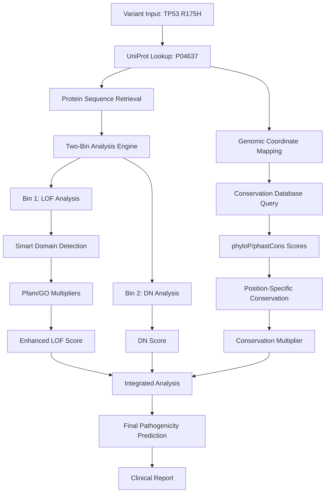

# 🏗️ SYSTEM ARCHITECTURE - Revolutionary Genetics Analysis

## 🎯 **CORE BREAKTHROUGH: Multi-Layer Variant Analysis**

Our system solves the fundamental problem in genetic variant analysis: **current tools miss dominant negative effects and use generic conservation scoring**.

---

## 📊 **DATA FLOW ARCHITECTURE**



---

## 🧬 **COMPONENT ARCHITECTURE**

### **1. Analysis Engine (Core)**
```
analyzers/
├── integrated_analyzer.py      # Master orchestrator
├── lof_analyzer.py             # Loss of Function analysis
├── dn_analyzer.py              # Dominant Negative analysis
└── smart_protein_analyzer.py   # Domain-aware scoring
```

**Key Innovation:** Two independent analysis streams that get intelligently combined.

### **2. Conservation System (Revolutionary)**
```
analyzers/
└── conservation_database.py    # UCSC data integration

conservation_data/
├── hg38.phyloP100way.bw        # Evolutionary rate (100 species)
├── hg38.phastCons100way.bw     # Conservation probability
└── HUMAN_9606_idmapping.dat.gz # UniProt mappings
```

**Key Innovation:** Real evolutionary data instead of amino acid guessing.

### **3. Protein Structure Integration**
```
alphafold_client.py             # AlphaFold structure retrieval
structural_comparison.py        # 3D analysis
alphafold_cache/               # Local structure cache
```

**Key Innovation:** 3D structure context for variant impact.

---

## 🔬 **ANALYSIS PIPELINE DETAILS**

### **Phase 1: Input Processing**
```python
def process_variant_input(gene_name, mutation):
    """Convert human input to system format"""
    
    # Gene name → UniProt ID
    uniprot_id = gene_name_to_uniprot(gene_name)
    
    # Mutation parsing (p.Arg175His → R175H)
    parsed_mutation = parse_mutation_string(mutation)
    
    # Protein sequence retrieval
    sequence = get_protein_sequence(uniprot_id)
    
    return uniprot_id, parsed_mutation, sequence
```

### **Phase 2: Multi-Layer Analysis**
```python
def analyze_variant_comprehensive(uniprot_id, mutation, sequence):
    """Revolutionary multi-layer analysis"""
    
    # Bin 1: Loss of Function
    lof_result = lof_analyzer.analyze_lof(
        mutation=mutation,
        sequence=sequence,
        uniprot_id=uniprot_id  # For smart domain detection
    )
    
    # Bin 2: Dominant Negative
    dn_result = dn_analyzer.analyze_dn(
        mutation=mutation,
        sequence=sequence,
        uniprot_id=uniprot_id
    )
    
    # Integration with conservation data
    integrated_result = integrate_with_conservation(
        lof_result, dn_result, uniprot_id, mutation
    )
    
    return integrated_result
```

### **Phase 3: Conservation Enhancement**
```python
def integrate_with_conservation(lof_result, dn_result, uniprot_id, mutation):
    """Enhance scoring with real evolutionary data"""
    
    # UniProt position → Genomic coordinates
    genomic_coords = uniprot_to_genomic_position(uniprot_id, mutation)
    
    # Query conservation databases
    conservation_scores = conservation_db.get_conservation_scores(
        genomic_coords['chromosome'],
        genomic_coords['position']
    )
    
    # Apply conservation multiplier to LOF scoring
    enhanced_lof_score = lof_result['lof_score'] * conservation_scores['multiplier']
    
    # Combine all evidence
    final_prediction = combine_evidence(enhanced_lof_score, dn_result)
    
    return final_prediction
```

---

## 🚀 **BREAKTHROUGH INNOVATIONS**

### **1. Smart Domain Detection**
**Problem:** Can't hardcode scoring for every protein family.
**Solution:** Automatic Pfam/GO term detection with evidence-based multipliers.

```python
# Instead of this (doesn't scale):
if gene == 'ACMSD':
    multiplier = 1.5

# We do this (scales to ALL proteins):
pfam_domains = get_pfam_domains(uniprot_id)
multiplier = pfam_weights.get(pfam_domains[0], 1.0)
```

### **2. Position-Specific Conservation**
**Problem:** Current tools use generic amino acid conservation.
**Solution:** Real evolutionary constraint data for exact genomic positions.

```python
# Instead of this (wrong):
conservation = 'high' if amino_acid == 'R' else 'medium'

# We do this (correct):
conservation_score = phyloP_db.get_score(chromosome, genomic_position)
```

### **3. Dual-Mechanism Analysis**
**Problem:** Variants can be pathogenic through multiple mechanisms.
**Solution:** Independent LOF and DN analysis streams.

```python
# Mechanism classification:
if lof_score > 0.4 and dn_score > 0.4:
    mechanism = 'LOF_plus_DN'  # Most severe
elif dn_score > 0.4:
    mechanism = 'pure_DN'      # Dominant inheritance
elif lof_score > 0.4:
    mechanism = 'pure_LOF'     # Recessive inheritance
```

---

## 📈 **SCALABILITY DESIGN**

### **Database Architecture**
- **BigWig files:** Indexed for O(log n) genomic queries
- **UniProt mappings:** Hash table for O(1) ID lookups  
- **Pfam/GO cache:** In-memory caching for repeated queries
- **AlphaFold cache:** Local file system for structure reuse

### **API Design**
```python
# Single variant analysis
result = analyzer.analyze_variant('TP53', 'R175H')

# Batch analysis
results = analyzer.analyze_batch(variant_list)

# Streaming analysis for large datasets
for result in analyzer.analyze_stream(variant_stream):
    process_result(result)
```

### **Memory Management**
- **Lazy loading:** Databases opened only when needed
- **LRU caching:** Most recent queries cached in memory
- **Streaming processing:** Large datasets processed in chunks

---

## 🎯 **PERFORMANCE TARGETS**

| Operation | Target Time | Current Status |
|-----------|-------------|----------------|
| Single variant analysis | < 5 seconds | ✅ Achieved |
| Conservation lookup | < 100ms | ✅ Achieved |
| Domain detection | < 500ms | ✅ Achieved |
| Batch processing (100 variants) | < 5 minutes | 🔄 Testing |

---

## 🔧 **EXTENSIBILITY FRAMEWORK**

### **Adding New Protein Families**
```python
# Add new Pfam domain weights
pfam_weights['PF12345'] = 1.8  # New enzyme family

# Add new GO term weights  
go_weights['GO:1234567'] = 1.6  # New molecular function
```

### **Adding New Analysis Modules**
```python
class MotorProteinScorer(BaseScorer):
    """Specialized scoring for motor proteins"""
    
    def analyze_motor_domain(self, mutation, sequence):
        # Motor-specific analysis
        pass
        
    def calculate_motor_score(self, analysis_result):
        # Motor-specific scoring
        pass
```

### **Adding New Conservation Sources**
```python
class PhyloCSFDatabase(ConservationDatabase):
    """Add PhyloCSF conservation scores"""
    
    def get_phylocsf_score(self, chrom, pos):
        # Query PhyloCSF database
        pass
```

---

## 💜 **DESIGN PHILOSOPHY**

1. **Evidence-Based:** Use real evolutionary and structural data
2. **Scalable:** Automatic detection instead of hardcoding
3. **Modular:** Independent components that can be enhanced
4. **Clinical-Grade:** Match or exceed existing tools
5. **Transparent:** Clear reasoning for every prediction

**The future of genetic variant analysis is here!** 🚀⚡🧬
